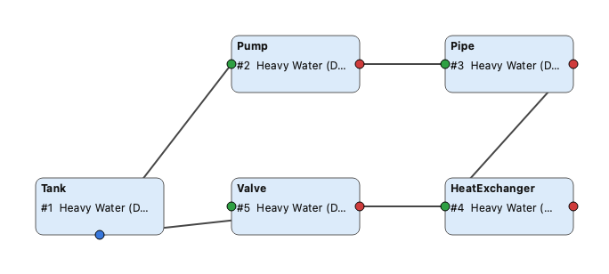
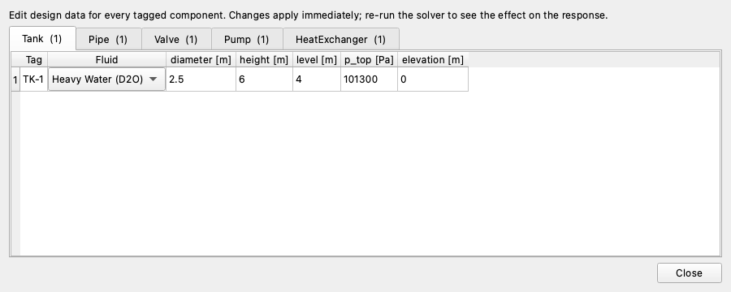
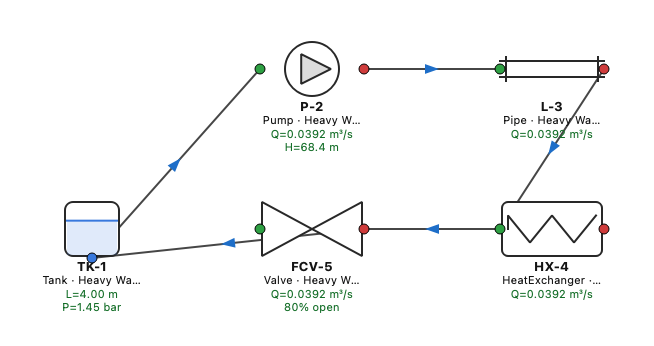
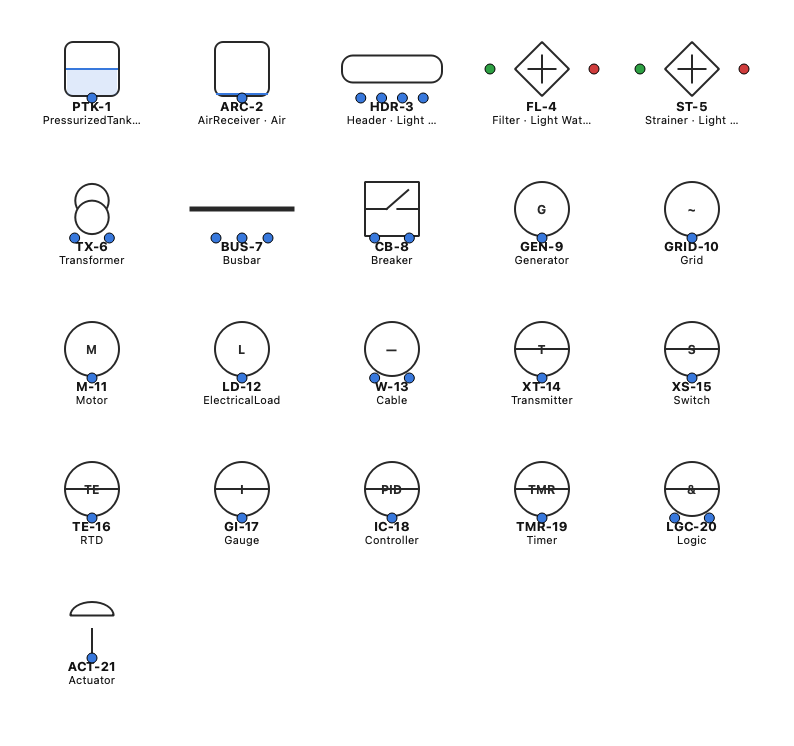
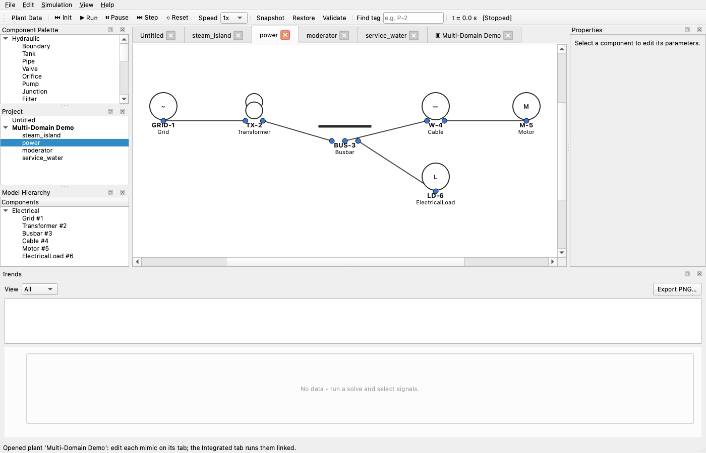

# UMPNAP — Unified Multi-Domain Process Network Analysis Platform

A local, offline, Qt-based process-network analysis platform. You drag components
from a palette onto a P&ID canvas, wire them together, configure parameters and a
working fluid, then solve the network and trend the results.

This is **Phase 1** of the design proposal: a real, analytically-validated
single-phase **hydraulic** Newton-Raphson solver, behind an architecture built to
accept the gas / thermal / electrical domains later.



*(The image above is a real render of the bundled `examples/loop.umpnap`: a closed
heavy-water loop — Tank → Pump → Pipe → Heat Exchanger → Valve → Tank.)*

## What works today

- **Drag-and-drop P&ID editor** (Qt `QGraphicsView`) with **standard P&ID symbols**
  per type (Boundary = circle, Pump = circle+impeller, Valve = bowtie, Tank =
  cylinder with live level, Orifice = plate, Pipe = flanged spool, HX = shell +
  serpentine, instruments = ISA bubbles). Place, drag to move, port-to-port wire,
  `Delete` to remove. Connection validation rejects inlet→inlet / outlet→outlet.
- **Editable P&ID tags** on every component (e.g. `P-101`, `FCV-203`), shown on the
  symbol and saved with the project. Build as many diagrams as you like with your
  own naming convention.
- **Plant Data datasheet** (`Edit ▸ Plant Data…`): one tab per component type, a
  table of your tagged instances against their design fields. Edit any cell —
  changes apply immediately and the next solve reflects them, so transient response
  tracks your plant data.
- **Detailed, equation-referenced models** with engineering design data: Pipe
  (Darcy-Weisbach + minor losses, ID/OD/roughness/tuning), Valve (IEC 60534 Kv with
  linear/equal-%/quick-open characteristic), Orifice (ISO 5167), Pump (head curve
  fitted from measured points or rated/shutoff datasheet, affinity laws),
  Heat Exchanger (shell-and-tube tube-side). Every law is heavily commented in
  `src/components/hydraulic/BranchLaw.cpp`; full write-up in
  [`docs/EQUATIONS.md`](EQUATIONS.md); summary shown live in the Properties dock.
- **Pump head–flow curve editor**: enter measured `(Q,H)` points; a least-squares
  quadratic (in-tree LU) drives the model.
- **Hydraulic solver**: nodal pressure formulation, Newton-Raphson with a dense LU
  linear solver, mass conservation at every node. Steady-state and transient
  (explicit-Euler tank-level integration).
- **Generic fluid property package**: Light Water, Heavy Water (D2O), Oil, Air,
  Helium, Nitrogen. The *same* component adapts to the selected fluid — no
  hardcoded fluid constants.
- **Expanded plugin library**: Boundary, Tank, Pipe, Valve, Orifice, Pump, Junction,
  Heat Exchanger (hydraulic) plus Transmitter, Actuator, Controller (instrument
  symbols; not yet solve-coupled). Palette, property editor, and datasheet are all
  generated from the registry.
- **Property editor**, **model-hierarchy browser**, **trend plots** (`QPainter`,
  per-series auto-scale), **CSV export**, and full **project save/load** (`.umpnap`).
- **In-app solver validation**: `Help ▸ Validate Solver` runs a series+parallel
  network with a closed-form answer and reports the error (matches to ~5e-10).



### Dynamic simulation engine & runtime monitoring

A live simulation engine (Simulation toolbar/menu) with **Run, Pause/Freeze,
Single-Step, Fast-Forward (1–20×), Reset, Save/Restore Snapshot**, a running
clock, and capturable/loadable **Initial Conditions** (`File ▸ Save/Load Initial
Condition`). One tick advances exactly one solver cycle; Single-Step advances one
(for debugging); Freeze stops sim time while you inspect/edit. As it runs, **live
values appear on every symbol** (pressure, flow, level, head, valve %) and
**animated arrows show flow direction** on each connection. Trends grow in real
time. Components can be **cloned** (`Ctrl+D`); projects carry a schema version.



### Control loops

A `Controller` links by tag to a measured component and an output valve and runs
a discrete PI law each cycle (`u = Kp·err + (Kp/Ti)·∫err`, clamped to valve
travel, with anti-windup). `examples/control.umpnap` holds a tank level at a 5 m
setpoint by modulating its inlet valve.

### Expanded multi-domain library

Beyond the core hydraulic set: **Filter, Strainer, Header, PressurizedTank,
AirReceiver, ReliefValve**, and pneumatic **Duct, Damper, Fan, Blower,
Compressor, GasReliefValve** (which solve on the nodal engine with Air); a
**Heat Transfer** group (**HeatExchanger**, plus split **ShellSide**/**TubeSide**);
plus **electrical** (Grid, Generator, Transformer, Busbar, Breaker, Cable, Motor,
Load — now solved by a DC power-flow) and **instrument/control** (Transmitter,
Switch, RTD, Gauge, Controller,
Timer, Logic, and valve actuators — generic **Actuator** plus **Electric**
(MOV), **Manual** (handwheel), and **Pneumatic** in both **modulating** and
**on/off** variants) as configurable, tagged P&ID symbols. Each draws its
standard glyph.

- **Pressure relief / safety valves** (hydraulic `ReliefValve`, air/gas
  `GasReliefValve`) are self-acting branches: shut until the differential
  reaches the set pressure, then opening over a blowdown band up to their full
  `Kv` (one-way, so also a check on reverse flow).
- **Attachment (drive) links** — valves/dampers carry an `act` signal port and
  pumps/fans/blowers/compressors an electrical `drive` port, so an **actuator
  can be wired to a valve** and a **motor to a pump**. These links record the
  driver on the P&ID; they do not create solver nodes (the nodal engine only
  ever builds nodes from fluid-carrying ports).
- **Air receiver with 20 tappings** (`p`, `n1…n19`) — a large plenum that ties
  many compressors and consumers together; the solver collapses every tapping
  onto one vessel pressure node. A **link tag** lets the *same* receiver be
  referenced from several mimic files (see below).



### Integrated multi-mimic plant projects

A single `.umpnap` file is one **mimic** (one subsystem). A **plant project**
(`.umpproj`) is a manifest that lists several mimics and runs them **as one
integrated network** so you can watch whole-plant dynamics. Equipment that is
physically shared between subsystems (a plant air receiver, a common header)
is given a **link tag** in its properties; mimics that carry the *same* link tag
are merged onto one instance, so a compressor drawn in one file and the
instrument-air consumers drawn in others all tap the *same* receiver. `File ▸
Open Plant Project…` (or `umpnap plant.umpproj`) merges every member mimic into
a single `Network`, which the existing solver runs in unison. See
[`docs/MULTI_MIMIC.md`](docs/MULTI_MIMIC.md); the bundled example is
`examples/plant.umpproj` (build `make_plant`).

**Tabbed multi-document workspace.** Opening a plant project now gives each
member mimic **its own editable canvas tab** — so different people develop
different subsystems independently — plus an **`▣ Integrated` tab** that merges
them and simulates the whole plant in unison (rebuilt from the live member nets,
or via `Simulation ▸ Rebuild Integrated Plant`). A **Project** explorer dock
nests each plant's members beneath it. Standalone `.umpnap` files open as single
tabs; each tab carries its own network, results, trends and simulation clock.



### Steam, electrical & split heat-exchanger solving

Three pragmatic domain solvers now produce real engineering numbers and feed the
trends, all coordinated by `SolverManager` (hydraulic → steam → electrical →
thermal each cycle):

- **Steam** — a compressible, isothermal **pressure-flow** solve over the
  steam-medium subnetwork (Steam Generator source, Condenser/Deaerator sinks,
  Turbine and ASDV/CSDV branches), mass-conserving Newton-Raphson with a
  Stodola-style swallowing law; records node pressures, steam mass flow and
  turbine power.
- **Electrical** — a **linear DC power-flow** by modified nodal analysis
  (`V = I·R`): Grid/Generator voltage sources, Cable resistances, ideal
  Transformer turns-ratio, closed/open Breakers, and Motor/Load conductances;
  records node voltages, branch currents and power.
- **Split shell-and-tube HX** — `ShellSide` and `TubeSide` are independent flow
  elements (each on its own mimic) that exchange heat when they share a
  `thermalTag`. The duty is computed by the **effectiveness-NTU** method from the
  per-stream mass flows and outlet temperatures recorded — so the shell can sit
  in a process-cooling loop and the tube in a moderator loop and still couple
  thermally in the integrated solve.

The bundled `examples/multidomain.umpproj` (build `make_multidomain`) wires all
three into one plant: a steam island, an electrical distribution, and a
moderator/service-water pair coupled across mimics by one split HX.

### Multi-domain modeling, media & validation

- **Library-grouped palette** — components are organised under Hydraulic /
  Air-Gas / Steam / Electrical / Instrumentation & Control; each type appears
  only under its library.
- **Per-port medium typing + connection validation** — every port has a medium
  (liquid/gas/steam/electrical/signal; process ports follow the fluid). Wiring
  rejects incompatible connections (e.g. a water boundary into an air duct) with
  a reason in the status bar.
- **Multi-fluid vessels** — Tank/PressurizedTank have a separate **cover-gas
  tapping** with its own gas fluid, so an air/gas network can attach to the
  vapour space. Steam equipment (Steam Generator, Turbine, Condenser, Deaerator,
  ASDV, CSDV) carries correct feedwater/steam/blowdown ports.
- **Named valve characteristics** — Linear / Equal-percentage / Quick-opening
  dropdown (in both the property editor and the datasheet).
- **P&ID tag search** in the toolbar — jump to any component by tag and view its
  data without loading from file.
- **Trend tools** — hover readout of values, a configurable view window
  (1/5/10/20 min), per-signal Y-axis range (double-click a signal), and PNG
  export.

> **Scope / roadmap.** This is a working core of the full digital-plant vision,
> not the whole thing. Delivered: the simulation engine, runtime monitoring,
> snapshots/initial conditions, a validated hydraulic+pneumatic nodal solver,
> a compressible-steam pressure-flow solver, a linear DC electrical power-flow
> solver, split shell-and-tube thermal coupling, a tabbed multi-document plant
> workspace, basic PID control, and a broad component library. **Not yet
> implemented:** full two-phase/steam-table thermodynamics and turbine Stodola
> modelling, AC power-flow with transformer leakage impedance, discrete
> logic/state-machine execution, and every component variant in the original
> spec. The architecture (common base, plugin registry, `ISolver` per domain) is
> built to extend into these without rework.

## What is stubbed (later phases)

Steam and electrical now solve pragmatically (isothermal compressible
pressure-flow; linear DC `V=I·R`). Still simplified: two-phase quality / steam
tables, AC magnitudes & phase, transformer leakage impedance, and true
compressible gas-inventory receiver dynamics. The `gas`/`thermal` `ISolver`
stubs remain as placeholders. One correct, validated hydraulic solver was
prioritised first, and the newer solvers build on the same nodal machinery.

## Dependencies

- A C++17 compiler (tested with Apple clang 17)
- CMake ≥ 3.16
- Qt6 Widgets — only needed for the GUI. The engine + tests build without Qt.
  - macOS: `brew install qt`
  - RHEL/Bharat Linux: install the `qt6-qtbase`/`qt6-qtbase-devel` packages

No other third-party libraries. The linear algebra and JSON I/O are in-tree, and
the platform makes **no network calls** (fully offline).

## Build, test, run

```bash
# Configure (point CMake at Qt; on macOS use the brew prefix)
cmake -S . -B build -DCMAKE_PREFIX_PATH="$(brew --prefix qt)"

# Build everything (engine, tests, GUI)
cmake --build build -j4

# Run the test suite (engine is Qt-free, so this works even without Qt)
ctest --test-dir build --output-on-failure

# Launch the GUI
./build/umpnap
```

If Qt6 is not found, CMake still builds the engine and tests (`ctest` passes);
only the `umpnap` GUI target is skipped.

### Using the app

1. Click a component type in the **Component Palette** (left), then click the
   canvas to place it.
2. Drag from one component's **port handle** (the colored dots) to another port to
   wire them. Green = inlet, red = outlet, blue = bidirectional.
3. Select a component to edit its parameters and **fluid** in the **Properties**
   dock (right).
4. `Run ▸ Run Steady` (or `Run ▸ Run Transient…`) to solve. Pick signals in the
   **Trends** dock (bottom) to plot pressure / flow / level / pump head / valve
   position. `File ▸ Export Results CSV…` to save.
5. `File ▸ Open…` `examples/loop.umpnap` to load the bundled example.

## Architecture

The engine is a Qt-free static library (`umpnap_engine`) so it is independently
testable; the GUI links it. The GUI never solves — it only edits a `Network`,
which the `SolverManager` consumes.

```
src/
  core/        Component, Network, ComponentRegistry, FluidLibrary,
               Results, Project (JSON)
  solver/      LinAlg (dense LU), NodeGraph, ISolver, HydraulicSolver,
               SteamSolver, ElectricalSolver, ThermalCoupling, SolverManager,
               StubSolvers, Validation
  components/
    hydraulic/ BranchLaw (Darcy-Weisbach, orifice, valve, pump, HX/shell/tube)
  gui/         DiagramScene + items, Palette/Project/Property/Hierarchy/Trend
               docks, tabbed MainWindow
tests/         13 CTest unit tests (LU, fluids, network, registry, branch laws,
               node graph, solver, validation, project round-trip, plant merge,
               steam/electrical/HX-coupling)
examples/      loop.umpnap + the generators that produced it, the multi-mimic
               plant.umpproj (make_plant) and multidomain.umpproj
               (make_multidomain: steam + electrical + split HX)
```

### Solver in one paragraph

Unknowns are the pressures at the network's free nodes (junctions collapse to a
single node; boundaries and tanks pin their pressure). Each branch element gives a
flow `Q(ΔP)` and its derivative: pipes use Darcy-Weisbach with a laminar/Swamee-Jain
friction factor, orifices/valves/heat-exchangers use a quadratic resistance, pumps
use a `H = H0 − a·Q²` head curve. Mass conservation at each free node forms
`F(P)=0`, solved by Newton-Raphson (`J·ΔP = −F` via dense LU) with a backtracking
line search. Transient runs integrate tank levels and re-solve each step. The
steam solver reuses the same Newton machinery on the steam-medium subnetwork
(mass-conserving, compressible `ṁ ∝ √(P₁²−P₂²)`); the electrical solver is one
linear MNA solve (`V=I·R`); the split-HX thermal pass runs after the hydraulic
solve using the per-stream flows — all into one `Results`.

## How to add a component

1. Register a `ComponentDef` (type, domain, ports, parameter schema) in
   `registerHydraulicComponents()` (`src/core/ComponentRegistry.cpp`).
2. If it is a flow element, add its `Q(ΔP)` law to `evalBranch`
   (`src/components/hydraulic/BranchLaw.cpp`) and list it in `isBranch`.

The palette, property editor, hierarchy, save/load, and solver pick it up
automatically — no GUI changes needed.

## Validation

`Help ▸ Validate Solver` (and the `validation_test` CTest) build a series+parallel
orifice network whose flow and node pressures have a closed-form solution, and
compare. Latest run: **max relative error ≈ 5e-10**, Newton converged in 6
iterations.
```
Q: solver=0.0162478  analytic=0.0162478   (err 5.0e-10)
```
